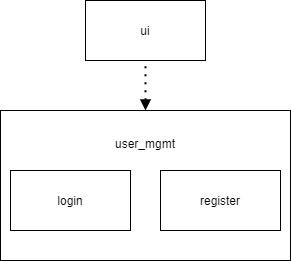
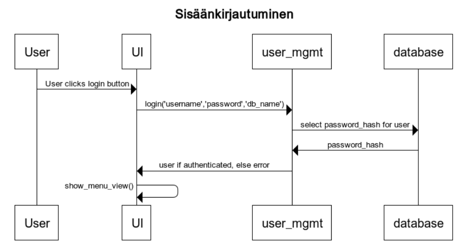
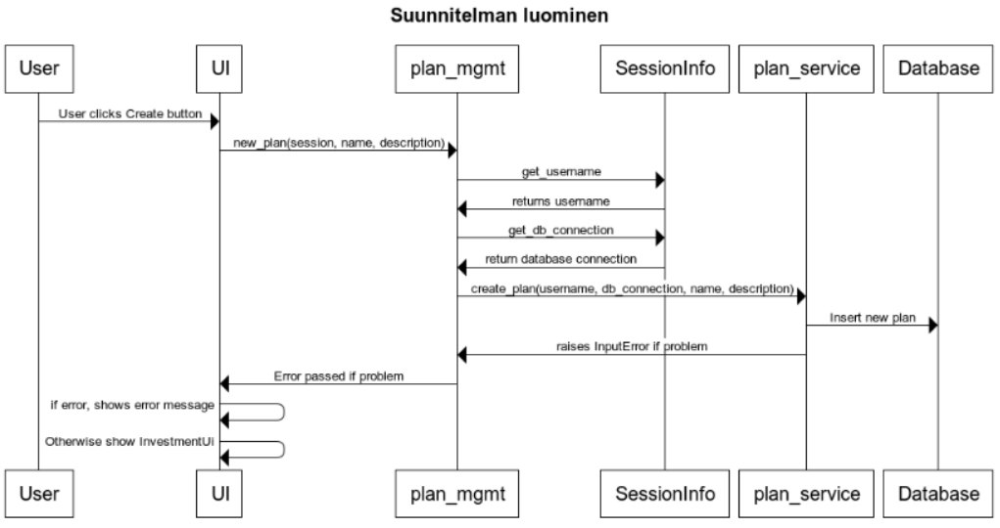
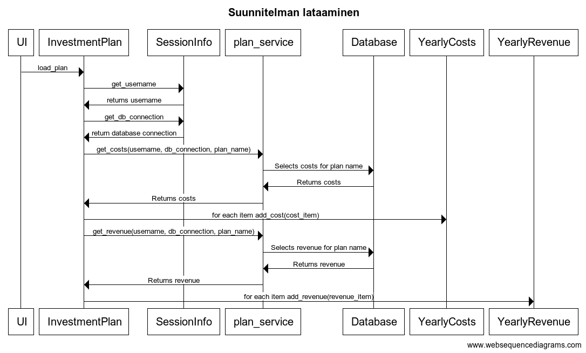
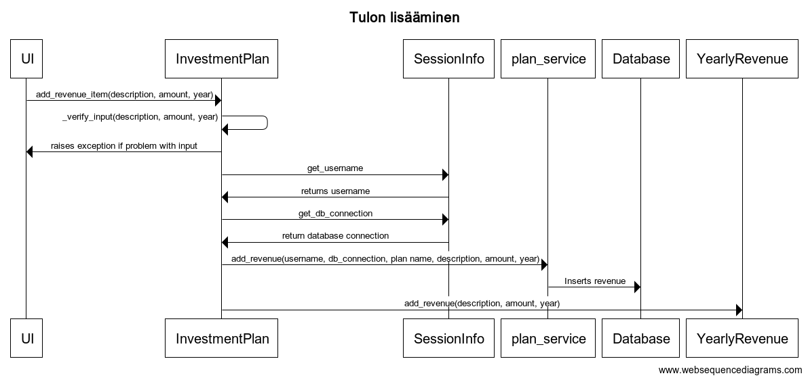
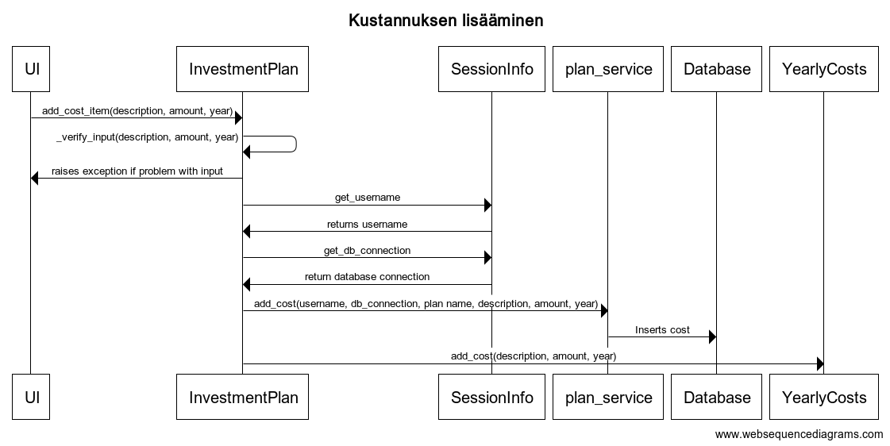

# Arkkitehtuurikuvaus

## Rakenne
Ohjelma on jaettu alla olevan kuvan mukaisesti kolmeen pääosaan. Näistä UI vastaa käyttöliittymästä. Logic vastaa ohjelmalogiikasta, eli pitää huolta käyttäjäsessiotiedoista, laskennasta ja kutsuu tarvittaessa data_service metodeja. Data_service taas hoitaa kaiken liikeenteen tietokannan kanssa.

## Sekvenssikaaviot
### Sisäänkirjautuminen
Sisäänkirjautuminen tapahtuu alla olevan sekvenssiokaavion mukaisesti.

Login painikkeen painamiseen reagoi tapahtumankäsittelijä, joka kutsuu sovelluslogiikan luokkaa SessionInfo. Sovelluslogiikka taas käyttä data_service kerrosta tarkistaakseen onko annettu salasana käyttäjälle oikein. Mikäli on, se tallentaa käyttäjänimen ja käyttäjälle aukeaa päävalikko.

Suunnitelman luominen tapahtuu alla olevan sekvenssiokaavion mukaisesti.

Käyttöliittymän tapahtumakäsittelijä kutsuu sovelluslogiikkakerrosta, joka hakee SessionInfo luokasta käyttäjätiedot ja kutsuu sen jälkeen data_service kerrosta, joka tallentaa uuden suunnitelman kantaan. Puuttuvasta nimestä nostetaan varoitus, jonka käyttöliittymä näyttää. Muuten näkymä vaihtuu investointisuunnitelmanäkymään juuri luodulle suunnitelmalle.

Suunnitelman lataaminen tapahtuu alla olevan sekvenssikaavion mukaisesti.

UI kutsuu suunnitelmaa avattaessa tai päivitettäessä sovelluslogiikkakerroksen InvestmentPlan luokkaa. Sovelluslogiikka hakee kirjautumis- ja tietokanta tiedot ja käyttää data_service tason palveluita kustannusten ja tulojen hakemiseen. Tämän jälkeen se luo YearlyCosts ja YearlyRevenue tyyppisen olion jokaiselle vuodelle jolla on kustannuksia tai liikevaihtoa ja tallentaa arvot niihin. Lisäksi se laskee sisäisesti näistä kannattavuuden.

Tulojen lisääminen tapahtuu alla olevan sekvenssiokaavion mukaisesti.

Käyttäliittymän tapahtumakäsittelijä kutsuu sovelluslogiikkakerroksen InvestmentPlan luokkaa, joka tarkistaa annetut tiedot. Väärän syötteen tapauksessa InvestmentPlan nostaa käyttöliittymälle virheen. Muussa tapauksessa se tarkistaa SessionInfo luokalta käyttäjän ja tietokannan ja kutsuu data_service tason funktioita liikevaihdon lisäämiseksi tietokantaan. Sen jälkeen InvestmentPlan joko luo uuden YearlyRevenue olion, mikäli annetulle vuodelle ei vielä sellaista ole, tai lisää liikevaihdon jo olemassa olevalle. Käyttöliittymä päivittää itsensä lisäämisen jälkeen uudella tiedolla.

Kulujen lisääminen tapahtuu alla olevan sekvenssikaavion mukaisesti.

Kulujen lisääminen tapahtuu kuin tulojen, mutta käyttämällä vastaavia, eri nimisiä luokkia ja metodeja kuten kaaviosta näkee.

## Käyttöliittymä
Näkymiä on seitsemän:
* Ensimmäinen on kirjautumista ja rekisteröintiä varten. 
* Toinen on menu, josta voi luoda uuden suunnitelman tai ladata vanhan.
* Kolmas on uusien suunnitelmien luomista varten.
* Neljäs on suunnitelmien lataamista varten.
* Viides on suunnitelmien näyttämistä ja muokkaamista varten.
* Kuudes ja seitsemäs ovat kulujen ja tulojen lisäämistä varten.
 
Näkymien näyttämisestä vastaa ui luokka.

## Tietokanta
Järjestelmä käyttää sqlite-tietokantaa. Tietokannassa on neljä taulua:
* Käyttäjätaulussa on käyttäjät ja salasanojen hashit. 
* Investointisuunnitelmataulussa on suunnitelmat, niiden nimet ja kuvaukset. Sitä käytetään kustannuksien ja tulojen yhdistämiseen oikeaa suunnitelmaa varten.
* Kustannukset taulu, jossa on suunnitelmaan kuuluvia kustannuksia, niiden kuvauksia, summia ja vuosia
* Liikevaihdot taulu, jossa on suunnitelman tulonlähteitä, niiden kuvauksia, summia ja vuosia
