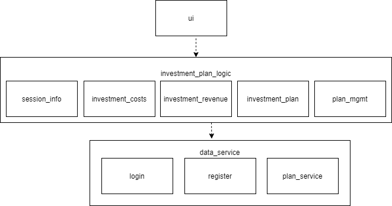
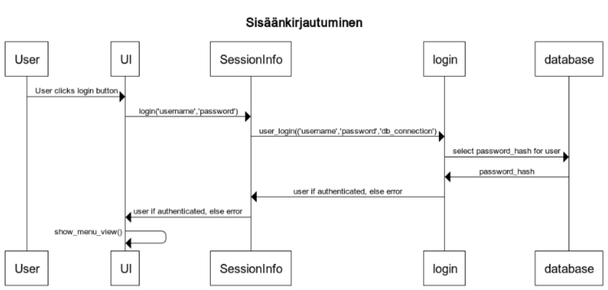

# Arkkitehtuurikuvaus

## Rakenne

## Sekvenssikaaviot
### Sisäänkirjautuminen

## Käyttöliittymä
Näkymiä on tällä hetkellä viisi. 
* Ensimmäinen on kirjautumista ja rekisteröintiä varten. 
* Toinen on menu, josta voi luoda uuden suunnitelman tai ladata vanhan.
* Kolmas on uusien suunnitelmien luomista varten.
* Neljäs on suunnitelmien lataamista varten.
* Viides on suunnitelmien näyttämistä ja muokkaamista varten, joskin se on drafti vaiheessa tällä hetkellä.
 
Näkymien näyttämisestä vastaa ui luokka.

## Tietokanta
Järjestelmä käyttää sqlite-tietokantaa. Tällä hetkellä tietokannassa on neljä taulua:
* Käyttäjätaulussa on käyttäjät ja salasanojen hashit. 
* Investointisuunnitelmataulussa on suunnitelmat, niiden nimet ja kuvaukset. Sitä käytetään kustannuksien ja tulojen yhdistämiseen oikeaa suunnitelmaa varten.
* Kustannukset taulu, jossa on suunnitelmaan kuuluvia kustannuksia, niiden kuvauksia, summia ja vuosia
* Liikevaihdot taulu, jossa on suunnitelman tulonlähteitä, niiden kuvauksia, summia ja vuosia
