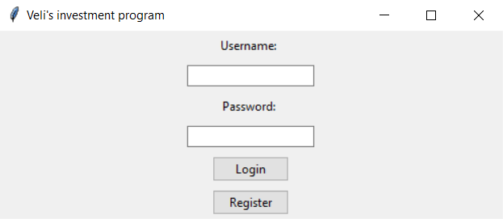
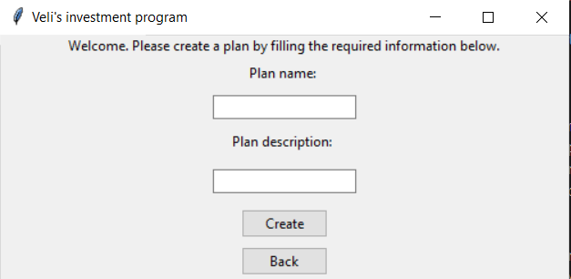
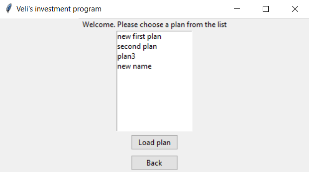
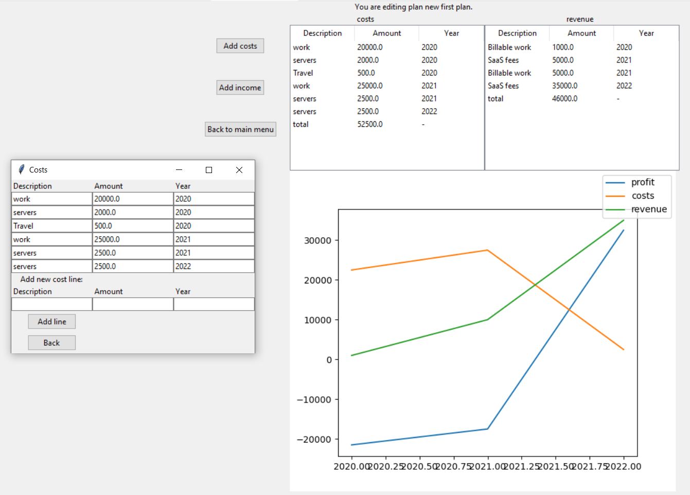

# Käyttöohje

## Asennus
* Riippuvuudet asennetaan komennolla `poetry install`
* Lisäksi matplotlib tarvitsee asentaa erikseen komennolla `pip3 install matplotlib==3.3.3`
* Tämän jälkeen sovelluksen voi käynnistää komennolla `poetry invoke start`

## Rekisteröinti ja kirjautuminen
Sovelluksen suorituksessa ensimmäisen aukeaa näkymä rekisteröinnille ja kirjautumiselle. Sovellus pyytää käyttäjältä käyttäjänimeä ja salasanaa, minkä jälkeen käyttäjä voi joko kirjautua sisään antamillaa tunnuksilla tai rekisteröidä uudet tunnukset, riippuen siitä kumpaa nappia käyttäjä painaa. Alla kuva näkymästä.

## Menu
Kirjauduttuaan sisälle käyttäjä voi valita luoko hän uuden suunnitelman vai lataako vanhan. Valikossa on nappi kummallekin vaihtoehdolle. 

Mikäli käyttäjä haluaa luoda uuden suunnitelman, aukeaa uusi näkymä, jossa käyttäjän pitää lisätä nimi ja kuvaus suunnitelmalle. Suunnitelman luominen tapahtuu tämän jälkeen painamalla nappia ja uusi suunnitelma aukeaa.Alla kuva näkymästä.

Jos käyttäjä haluaa ladata suunnitelman, hän näkee listan suunnitelmista. Suunnitelma avataan valitsemalla listasta haluttu suunnitelma ja painamalla alla olevaa nappia. 

## Suunnitelmat
Sivulla on 3 nappia. Yhdellä näistä lisätään kustannuseriä, toisella tuloja ja kolmannella pääsee takaisin valikkoon.

Keskellä näkymää on kaksi taulua, joissa on suunnitelmalle lisätyt kustannus- ja tuloerät. Näiden alapuolella on graafi, jossa kustannukset, tulot ja kannattavuus näkyvät ajan funktiona. Alla kuva näkymästä.

### Kulujen lisääminen
Painamalla Add costs -nappia, järjestelmä avaa popupin, jossa näkee nykyiset kuluerät ja voi lisätä uusia. Tämä tapahtuu lisäämällä kenttiin kuvaus kuluerästä, sen suuruus ja sen vuosi. Lisätyt kuluerät tallentuvat automaattisesti ja näkyvät päänäkymässä.

### Tulojen lisääminen
Painamalla Add income -nappia, järjestelmä avaa popupin, jossa näkee nykyiset tulonlähteet ja voi lisätä uusia. Tämä tapahtuu lisäämällä kenttiin kuvaus tulonlähteestä, sen suuruus ja sen vuosi. Lisätyt tulot tallentuvat automaattisesti ja näkyvät päänäkymässä.